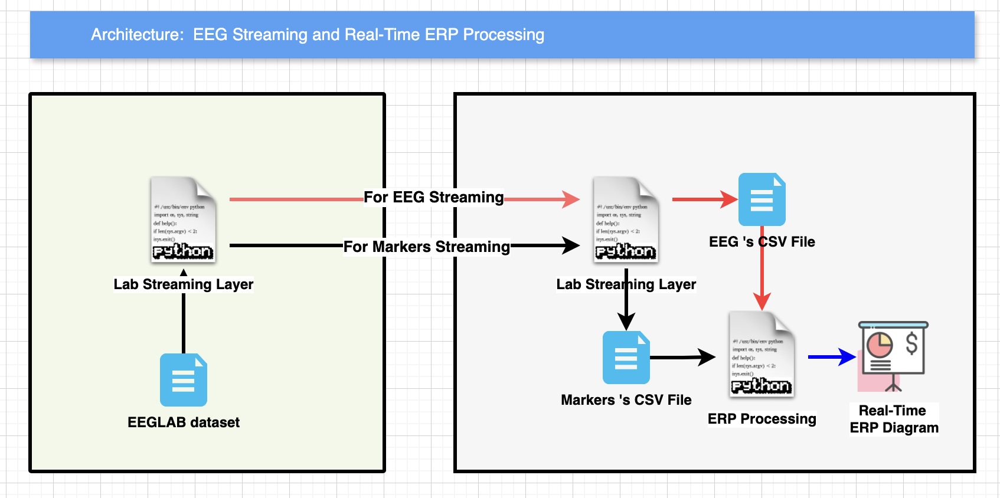

# EEG Real-Time Streaming and Processing ERP Diagram
> This project is a real-time EEG Streaming and Processing project.
> The project is developed by using the EEG data from eeglab dataset.

## System Architecture


## How to Run the Project
> To run the project, you need to follow the following steps:
> And prepare data file at ./data/att_006_game_ref_clean.fdt
and ./data/att_006_game_ref_clean.set
1. Clone the project
2. Install the required libraries
3. Run the `eeg_receiving.py` file with the following command:
```bash
python eeg_receiving.py
```
4. Run the `eeglab_streaming.py` file with the following command:
```bash
python eeglab_streaming.py
```
5. Then you can see the EEG data will be generate ERP in the real-time.